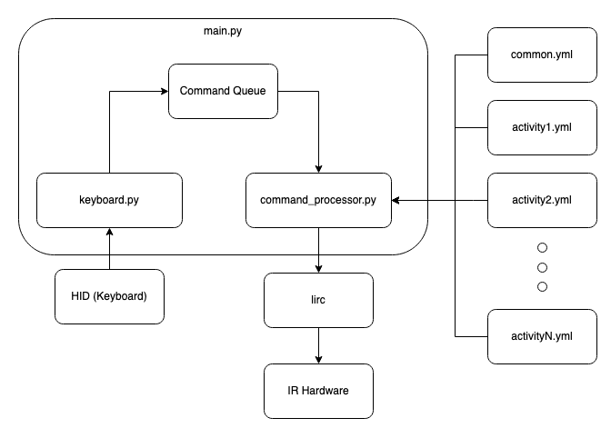

# my_remote

my_remote is a universal remote hub running on a Raspberry PI.  It translates keyboard presses into commands for remote controlled devices.  It's goal is to provide a single way for controlling remote controlled devices via a remote control.

## Progress

| Feature           | Progress           |
| ----------------- | ------------------ |
| IR Support        | Working            |
| Bluetooth Support | Not Working        |
| ADB Support       | Working (slow)     |
| curl              | Working (untested) |
| app calls         | Not Working        |

## Installation

my_remote runs on a [Raspberry Pi](https://www.raspberrypi.org/) with an [IR interface](https://www.crowdsupply.com/anavi-technology/infrared-phat).

### Quick install

ssh to the raspberry pi and run the below.  This has only been tested on a newly flashed Raspberry Pi 4 with Raspberry Pi OS Lite (32-bit)(03-04-2021).

```shell
curl https://raw.githubusercontent.com/benjaminmetzler/my_remote/main/setup_pi4.sh | bash
```

This will update the system, install the needed packages, lirc, and other miscellaneous actions.

### Long Install

If you don't feel safe just randomly running a script from the Internet:

1. [Boot a Raspberry Pi with the `Raspberry Pi OS Lite (32-bit)` image](https://www.raspberrypi.org/documentation/installation/installing-images/). Tested version is 03-04-2021.
    * Make sure to enable ssh as a directly connected keyboard could be captured by my_remote.
1. Insert the SD card into the raspberry pi and power it up.
1. Connect to the pi with ssh.
1. Update the pi and install git.
    * `sudo apt update; sudo apt -y upgrade; sudo apt install -y git`
1. Clone the repo.
    * `git clone https://github.com/benjaminmetzler/my_remote.git`
1. Change into the local directory
    * `cd my_remote`
1. Run the setup.  The pi will reboot after the script has finished.
    * `sh setup_pi4.sh`
1. ssh back into the pi
1. cd into the my_remote directory and run main.sh
    * `cd my_remote; bash main.sh`

my_remote will start and listen for keystrokes from a directly connected keyboard.  Depending on the keystroke, my_remote will take different actions.  When first booted, it will load the `json/common.json` file.

## Design



my_remote takes input from a keyboard or an HID remote and converts it into an appropriate format.  my_remote uses json files to it's current state. Each state defines the actions that my_remote takes when an HID button is pressed.  The format of these json files is documented [here](documentation/json_format.md).

## Contributing

Pull requests are welcome. Help with enabling the Raspberry Pi as a functional bluetooth HID to an android device (think Nvidia Shield) is greatly appreciated.  For major changes, please open an issue first to discuss what you would like to change.

## Links

* https://github.com/AnaviTechnology/anavi-docs/blob/master/anavi-infrared-phat/anavi-infrared-phat.md
* https://globalcache.zendesk.com/hc/en-us/articles/360034968311-iConvert-Converting-IR-code-formats
* https://www.instructables.com/Transforming-Raspberry-Pi-Into-a-Remote-Control/
* https://projects-raspberry.com/emulate-a-bluetooth-keyboard-with-the-raspberry-pi/
* https://remotesource.net/full-remote-catalog/
* https://github.com/boppreh/keyboard
* https://flirc.tv/more/flirc-usb
* https://github.com/ruundii/bthidhub
* https://github.com/quangthanh010290/keyboard_mouse_emulate_on_raspberry
* https://www.lirc.org
* https://www.raspberrypi.org/
* https://www.crowdsupply.com/anavi-technology/infrared-phat
* https://github.com/AnaviTechnology/anavi-docs/blob/master/anavi-infrared-phat/anavi-infrared-phat.md
* https://www.aliexpress.com/item/1005001714763038.html
* https://github.com/mtlynch/key-mime-pi
* https://pyatv.dev/documentation/getting-started/

## License

[See LICENSE](https://github.com/benjaminmetzler/my_remote/blob/main/LICENSE)
