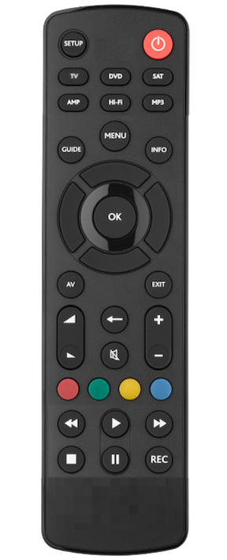

# Introduction

With the [Logitech announcement closing down the Harmony remote line](https://www.theverge.com/2021/4/10/22377015/logitech-discontinues-harmony-universal-remotes), I am finding myself looking towards the future of remote controls.  

I was along time user of the beloved RadioShack [15-2116](https://www.mythtv.org/wiki/RadioShack_15-2116_Universal_Remote) with the [JP1](https://en.wikipedia.org/wiki/JP1_remote) functionality.  I used it for years, buying them on ebay long after RadioShack stopped making them.  It was a bit of an effort to set up but once it was working, it just worked.  But technology progressed and I grew frustrated at having to re-learn how to program my remote every time I wanted to change something or add a device.  I moved to the Harmony Hub with companion remote because it offered most of what I wanted and had a workable interface for programming the remote.  But now Harmony is dead and I want to find another solution.

There are lots of apps that use the smart phone as an interface but I prefer my remotes have physical button devices that work fast and I can use without looking at the remote.  While there are other commercial options for universal remotes I'm reluctant to buy into another company's infrastructure knowing they could shut down at any point. 

That leaves me with building my own remote control infrastructure.  I've decided to start doing that and documenting my efforts here.  I'm not looking to create an all-in-one remote that does everything.  I want to create a remote that does the 95% of a users needs.  That said I know that people want different things then what I want so making a programmable remote is the logical step.

# Requirements

My remote control requirements:

1. Physical buttons
1. Rechargeable batteries
1. Controls at least 4 devices
1. Simultaneous multi-device control, e.g. the volume buttons send signals to the receiver, all other buttons to the DVR.
1. Macro support on any button
1. IR support
1. [Bluetooth support](https://projects-raspberry.com/emulate-a-bluetooth-keyboard-with-the-raspberry-pi/)

Years ago I would have insisted on the remote having number buttons but the UIs on most STB are fully navigable with just a D-Pad.  I think a simpler remote would be better overall.  If I were to dream up a remote it would look something like this:

It's basically a [URC1280](https://www.oneforall.com/universal-remotes/urc-1280-contour-8#/step-1) with the 0-9 buttons removed and some of the other buttons moved around.  I like it's simplicity and it can probably cover 99% of my remote control needs.  That said it can be more refined.

# Options

## [lirc](https://www.lirc.org/)

lirc is the Linux Infrared Remote Control package that allows you to send and receive IR commands.  It is the defacto standard for doing IR on Linux with a whole suite of functionality.  I found a set of discrete [Pronto](https://www.mythtv.org/wiki/Philips_Pronto) hex codes for my 2011 Toshiba TV that I could easily convert using `pronto2lirc`, a tool that's part of the lirc install.  What took me hours of research with my JP1 programming and what I couldn't do with the Harmony Hub was done in about 10 minutes.

## [Raspberry Pi](https://www.raspberrypi.org/)

A standard piece of hardware for the home hacker.  Linux support and expandability in a small, low-cost board].

## [AVANI Infrared pHAT](https://www.crowdsupply.com/anavi-technology/infrared-phat)

Probably overkill for my needs but it it has an IR received and two transmitters.
https://github.com/AnaviTechnology/anavi-docs/blob/master/anavi-infrared-phat/anavi-infrared-phat.md

## [L8STAR G20S Pro](https://www.aliexpress.com/item/1005001714763038.html) 

It's not exactly what I want for a remote, but it does RF and can act like a keyboard (I think).  I can use it for development and for only $10 shipped, it's not a terrible option.

# Links
* https://globalcache.zendesk.com/hc/en-us/articles/360034968311-iConvert-Converting-IR-code-formats
* https://www.instructables.com/Transforming-Raspberry-Pi-Into-a-Remote-Control/
* https://projects-raspberry.com/emulate-a-bluetooth-keyboard-with-the-raspberry-pi/
* https://remotesource.net/full-remote-catalog/

