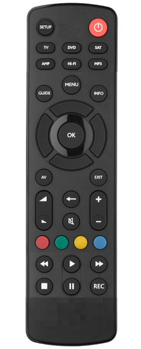

# my_remote

## Introduction

With the [Logitech announcement closing down the Harmony remote line](https://www.theverge.com/2021/4/10/22377015/logitech-discontinues-harmony-universal-remotes), I am finding myself looking towards the future of remote controls.

For years I used the RadioShack [15-2116](https://www.mythtv.org/wiki/RadioShack_15-2116_Universal_Remote) in conjunction with with the [JP1](https://en.wikipedia.org/wiki/JP1_remote) interface.  It was great because I could program the remote to work exactly like I wanted, expanding it with new codes and macros.  It was a bit of an effort to set up but once it was working, it just worked.  But technology progressed and I grew frustrated at having to re-learn how to program my remote every time I wanted to change something.  I moved to the Harmony Hub with companion remote because it offered most of what I wanted and had a workable interface for programming the remote.  But now Harmony is dead and I want to find another solution.

There are lots of apps that use the smart phone as an interface but I prefer my remotes have physical button devices.  Plus a phone app requires I unlock the phone and wait for the webpage or app to load before I can do anything.  And while there are other commercial options for universal remotes the current landscape for remotes is relatively bland.  I'm also reluctant to buy into another company's infrastructure.

That leaves me with building my own remote control infrastructure.  This repo is my documentation for that project.  It will contain my general notes, my designs, my code, and anything else I want to add to it.  I'm not looking to create an all-in-one remote that does everything.  I want to create a remote that does the 95% of my needs.  That said I know that people want different things then what I want so making a programmable remote is the logical step.

## Philosophy

My philosophy for remote controls has changed over the years.  Early on I would have wanted one remote that did everything.  If I wanted to adjust sound, the remote did it.  If I wanted to adjust the picture, the remote could do that as well.  Now I think a better approach to have a simple remote that handles the functions I use on a day-to-day basis.  Volume and mute are still important, but I don't need the remote to be able to switch the simulated audio mode.  This simpler approach has the advantage of a allowing me to have a small number of buttons.  I think a simpler remote would be better overall.  If I were to dream up a remote it would look something like this:

It's basically a [URC1280](https://www.oneforall.com/universal-remotes/urc-1280-contour-8#/step-1) with the 0-9 buttons removed and some of the other buttons moved around.  I like it's simplicity and it can probably cover 99% of my remote control needs.  That said it can be more refined.

## Requirements
My Remote requirements:

1. Any remote can work.
1. Control for at least 4 devices
1. Simultaneous multi-device control, e.g. the volume buttons send signals to the receiver, all other buttons to the DVR.
1. Macro support on any button
1. IR support
1. [Bluetooth support](https://projects-raspberry.com/emulate-a-bluetooth-keyboard-with-the-raspberry-pi/)

## Design

My Remote uses the hub model.  A low power device (like a Raspberry Pi) will handle the modes, with the actual remote being just a "dumb" device that send signals to the hub.  The hub will decide what happens when the play button is pressed depending on the state of the hub.

The hub will have modes.  My Remote will do different things based on the current mode it is in.  If it's in DVD mode, it will send the PLAY button press using the DVD PLAY IR code.  If it's in STB mode, then an bluetooth UP press will be sent to the STB.

My Remote tracks it's mode only.  The hub doesn't know the state of the devices.  That was one thing I disliked about the Harmony Remotes.  It was supposed to "know" what state my devices were in.  Often it failed.  It wasn't a problem with the Harmony, it's just that the devices could get into all sorts of states and with the lack of discrete toggles (power, inputs, etc.) that easily confused the Harmony system.  My Remote won't have to deal with that logic.

## Technologies

### [lirc](https://www.lirc.org/)

lirc is the Linux Infrared Remote Control package that allows you to send and receive IR commands.  It is the defacto standard for doing IR on Linux with a whole suite of functionality.  I found a set of discrete [Pronto](https://www.mythtv.org/wiki/Philips_Pronto) hex codes for my 2011 Toshiba TV that I could easily convert using `pronto2lirc`, a tool that's part of the lirc install.  What took me hours of research in my JP1 programming days and what I couldn't do with the Harmony Hub was done in about 10 minutes with lirc.

### [Raspberry Pi](https://www.raspberrypi.org/)

A standard piece of hardware for the home hacker.  Linux support and expandability in a small, low-cost board].

### [AVANI Infrared pHAT](https://www.crowdsupply.com/anavi-technology/infrared-phat)

Probably overkill for my needs but it it has an IR received and two transmitters.
https://github.com/AnaviTechnology/anavi-docs/blob/master/anavi-infrared-phat/anavi-infrared-phat.md

## #[L8STAR G20S Pro](https://www.aliexpress.com/item/1005001714763038.html)

It's not exactly what I want for a remote, but it does RF and can act like a keyboard (I think).  I can use it for development and for only $10 shipped, it's not a terrible option.
